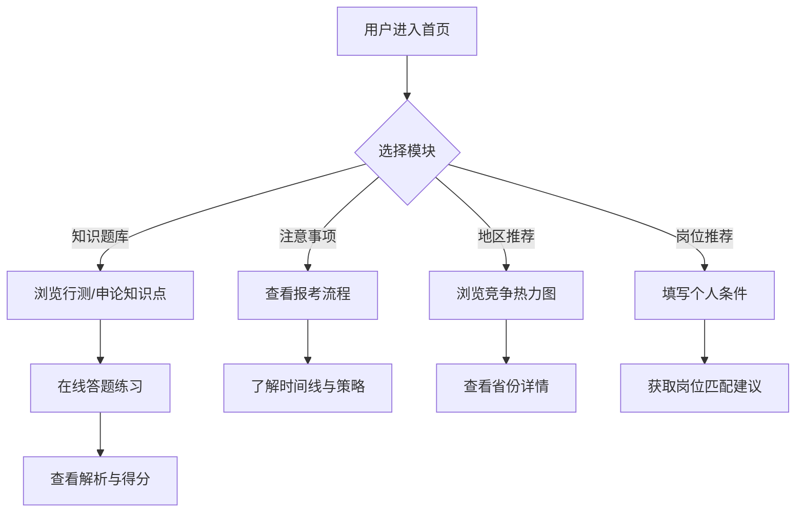

# 考公助手 — 产品需求文档 (PRD)

## 1. 产品概述

考公助手是一款面向公务员考试备考人群的一站式信息服务平台，整合知识题库、备考注意事项、地区竞争分析和岗位推荐四大核心模块，帮助考生从"学什么、怎么考、去哪考、报什么岗"四个维度高效决策、精准备考。

- **目标用户**：应届毕业生、在职转行人员、在校大学生等有考公意向的人群
- **核心价值**：一站聚合考公全链路信息，降低信息搜集成本，辅助科学选岗决策

## 2. 核心功能

### 2.1 功能模块

1. **考公知识题库**：行测六大模块 + 申论五大题型的知识点梳理与模拟练习
2. **考公注意事项**：报考流程、考试时间线、备考策略、国考省考对比等关键信息
3. **考公地区推荐**：全国各省市竞争比、进面分数线、难度梯队分析与推荐
4. **岗位推荐**：基于用户背景（学历、专业、应届/往届等）的个性化岗位匹配建议

### 2.2 页面详情

| 页面名称 | 模块名称 | 功能描述 |
|---------|---------|---------|
| 首页 | 导航入口 | 四大模块卡片入口，快速跳转；考试倒计时提醒 |
| 首页 | 考试倒计时 | 展示距离最近国考/省考的天数 |
| 题库页 | 行测模块 | 政治理论、常识判断、言语理解、数量关系、判断推理、资料分析六大模块，每模块展示知识点卡片与样题 |
| 题库页 | 申论模块 | 归纳概括、综合分析、提出对策、应用文写作、大作文五大题型，展示答题模板与写作框架 |
| 题库页 | 答题练习 | 选择题在线作答，即时判分与解析 |
| 注意事项页 | 报考流程 | 九步报考流程图（查询职位→报名→审查→缴费→准考证→笔试→面试→体检→录用） |
| 注意事项页 | 关键时间线 | 国考/省考关键时间节点时间轴 |
| 注意事项页 | 国考vs省考对比 | 双栏对比表：组织单位、竞争比、题目难度、薪资待遇、发展空间等 |
| 注意事项页 | 备考策略 | 行测做题顺序建议、申论写作技巧、考场提分贴士 |
| 地区推荐页 | 全国竞争热力图 | 可视化展示各省竞争比与进面分数线 |
| 地区推荐页 | 难度梯队排行 | 地狱模式→上岸友好 四梯队分类展示 |
| 地区推荐页 | 省份详情卡片 | 点击省份查看详细考情（招录规模、报录比、进面分、户籍限制、薪资水平） |
| 岗位推荐页 | 个人条件筛选 | 学历、专业、应届/往届、政治面貌、目标地区等筛选条件 |
| 岗位推荐页 | 推荐结果展示 | 匹配的考试类型（国考/省考/选调生）及岗位类型建议，附理由说明 |
| 岗位推荐页 | 岗位对比 | 多岗位横向对比：竞争比、发展前景、薪资待遇、上岸难度 |

## 3. 核心流程

用户进入首页 → 根据需求选择四大模块之一：
- **想刷题学习** → 进入题库页 → 选择行测/申论模块 → 浏览知识点 → 在线答题练习
- **想了解考试信息** → 进入注意事项页 → 查看报考流程/时间线/国省考对比
- **想选地区** → 进入地区推荐页 → 浏览全国竞争热力图 → 查看省份详情
- **想选岗位** → 进入岗位推荐页 → 填写个人条件 → 获取推荐结果

## 4. 用户界面设计

### 4.1 设计风格

- **主题**：沉稳专业 + 现代简约，传递"可靠、权威、高效"的品牌感
- **主色调**：藏蓝 (#1a365d) 为主色，搭配暖金 (#d4a853) 作为强调色，背景为浅灰白 (#f7f8fa)
- **字体**：标题使用 "Noto Serif SC"（思源宋体）体现庄重感，正文使用 "PingFang SC" 或系统默认字体保证可读性
- **按钮风格**：微圆角 (8px)，主按钮藏蓝填充白字，次按钮描边样式
- **卡片风格**：白色卡片带细微阴影 (0 2px 12px rgba(0,0,0,0.06))，圆角 12px
- **布局**：顶部固定导航栏，内容区最大宽度 1200px 居中，响应式适配

### 4.2 页面设计概览

| 页面名称 | 模块名称 | UI 元素 |
|---------|---------|--------|
| 首页 | Hero 区域 | 大标题 "考公助手" + 副标题，考试倒计时卡片，渐变背景 |
| 首页 | 模块入口 | 四张功能卡片 2x2 网格，每张含图标 + 标题 + 简述，hover 上浮动画 |
| 题库页 | 模块选择 | 左右切换 Tab（行测/申论），子模块卡片网格 |
| 题库页 | 知识点卡片 | 模块名称 + 考点标签 + 题目数量，点击展开详情 |
| 题库页 | 答题区 | 题目卡片 + 四选项 + 提交按钮 + 即时反馈动画 |
| 注意事项页 | 流程图 | 横向步骤条，每步含图标 + 描述，hover 展开详情 |
| 注意事项页 | 对比表 | 双栏表格，斑马纹行，关键数据高亮 |
| 地区推荐页 | 热力图 | 中国地图简化版（或色块矩阵），各省按竞争比着色 |
| 地区推荐页 | 省份卡片 | 省份名 + 竞争比 + 进面分 + 难度标签，网格排列 |
| 岗位推荐页 | 筛选表单 | 下拉选择 + 标签选择器，藏蓝主题 |
| 岗位推荐页 | 结果卡片 | 推荐岗位名 + 匹配度百分比 + 理由说明 + 对比按钮 |

### 4.3 响应式设计

- 桌面端优先设计（1200px 最大宽度居中）
- 平板端 (768px-1024px)：卡片 2 列变 1 列，导航收缩
- 移动端 (<768px)：汉堡菜单导航，卡片全宽堆叠，表单全宽

## 5. 数据来源说明

所有考公数据（知识点、分数线、竞争比、岗位信息）来源于公开的官方考试大纲、历年招录公告及权威公考机构分析，以静态 Mock 数据形式内嵌于前端项目中，确保数据可离线访问且稳定可靠。