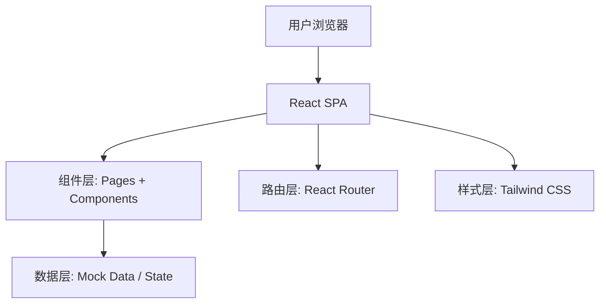

# 考公助手 — 技术架构文档

## 1. 架构设计

采用纯前端单页应用 (SPA) 架构，无需后端服务，所有数据以静态 Mock 数据形式内嵌。



## 2. 技术选型

| 层级 | 技术 | 说明 |
|------|------|------|
| 前端框架 | React 18 + TypeScript | 类型安全，组件化开发 |
| 构建工具 | Vite 5 | 快速 HMR，开箱即用 |
| 样式方案 | Tailwind CSS 3 | 原子化 CSS，快速构建 |
| 路由 | React Router v6 | SPA 页面路由 |
| 状态管理 | React Context + useReducer | 轻量级，无需引入额外库 |
| UI 组件 | 无第三方 UI 库，纯手写组件 | 体现设计独特性 |
| 图标 | Lucide React | 轻量图标库 |
| 动画 | Framer Motion | 页面过渡与微交互 |
| 数据 | 静态 TS/JSON Mock 数据 | 无需后端，所有数据内嵌 |

## 3. 路由定义

| 路由 | 页面 | 说明 |
|------|------|------|
| / | 首页 | 四大模块入口 + 考试倒计时 |
| /question-bank | 知识题库 | 行测/申论知识点与答题 |
| /tips | 注意事项 | 报考流程、时间线、策略 |
| /region | 地区推荐 | 全国竞争分析与省份详情 |
| /position | 岗位推荐 | 条件筛选与岗位匹配 |

## 4. 数据模型

### 4.1 题库数据模型

```typescript
// 行测模块
interface ExamModule {
  id: string;
  name: string;           // 模块名称，如"言语理解与表达"
  category: 'xingce' | 'shenlun';
  description: string;    // 模块描述
  topics: KnowledgeTopic[];
}

interface KnowledgeTopic {
  id: string;
  title: string;          // 知识点标题
  content: string;        // 知识点内容
  keyPoints: string[];    // 关键要点
  sampleQuestions: Question[];
}

interface Question {
  id: string;
  type: 'single' | 'multiple';
  stem: string;           // 题干
  options: string[];      // 选项
  answer: number;         // 正确答案索引
  explanation: string;    // 解析
}
```

### 4.2 地区数据模型

```typescript
interface RegionData {
  province: string;         // 省份名称
  examType: '国考' | '省考';
  recruitmentScale: number; // 招录规模
  competitionRatio: number; // 竞争比，如 50:1
  entryScore: number;       // 平均进面分
  maxEntryScore: number;    // 最高进面分
  tier: 1 | 2 | 3 | 4;     // 难度梯队
  salaryRange: string;      // 薪资范围
  tags: string[];           // 标签，如"限户籍"、"应届友好"
  description: string;      // 概述
}
```

### 4.3 岗位推荐数据模型

```typescript
interface PositionRecommendation {
  id: string;
  examType: '国考' | '省考' | '选调生';
  positionType: string;     // 岗位类型
  suitableFor: {            // 适合人群条件
    education: string[];    // 学历
    majors: string[];       // 专业
    isFreshGrad: boolean;   // 是否应届
    politicalStatus: string[]; // 政治面貌
  };
  competitionRatio: string; // 竞争比
  developmentProspect: string; // 发展前景
  salaryLevel: string;      // 薪资水平
  recommendationReason: string; // 推荐理由
}
```

## 5. 组件树

```
App
├── Layout
│   ├── Navbar (顶部导航)
│   └── Footer
├── Pages
│   ├── HomePage
│   │   ├── HeroSection (标题 + 倒计时)
│   │   └── ModuleCards (四大模块入口卡片)
│   ├── QuestionBankPage
│   │   ├── CategoryTabs (行测/申论 Tab)
│   │   ├── ModuleGrid (模块卡片网格)
│   │   ├── TopicDetail (知识点详情)
│   │   └── QuizPanel (答题面板)
│   ├── TipsPage
│   │   ├── ProcessTimeline (报考流程时间轴)
│   │   ├── ExamComparison (国省考对比表)
│   │   └── StrategyCards (备考策略卡片)
│   ├── RegionPage
│   │   ├── HeatmapView (竞争热力图)
│   │   ├── TierList (难度梯队列表)
│   │   └── ProvinceDetail (省份详情弹窗)
│   └── PositionPage
│       ├── FilterForm (条件筛选表单)
│       ├── ResultList (推荐结果列表)
│       └── CompareModal (岗位对比弹窗)
└── Shared
    ├── Card (通用卡片)
    ├── Badge (标签)
    ├── ProgressBar (进度条)
    └── Modal (弹窗)
```

## 6. 项目结构

```
kaogong-helper/
├── public/
├── src/
│   ├── components/          # 共享组件
│   │   ├── Layout/
│   │   ├── Card.tsx
│   │   ├── Badge.tsx
│   │   └── Modal.tsx
│   ├── pages/               # 页面组件
│   │   ├── HomePage.tsx
│   │   ├── QuestionBankPage.tsx
│   │   ├── TipsPage.tsx
│   │   ├── RegionPage.tsx
│   │   └── PositionPage.tsx
│   ├── data/                # Mock 数据
│   │   ├── questionBank.ts
│   │   ├── regions.ts
│   │   ├── positions.ts
│   │   └── tips.ts
│   ├── types/               # TypeScript 类型定义
│   │   └── index.ts
│   ├── hooks/               # 自定义 Hooks
│   ├── App.tsx
│   ├── main.tsx
│   └── index.css
├── index.html
├── package.json
├── tsconfig.json
├── vite.config.ts
├── tailwind.config.js
└── postcss.config.js
```